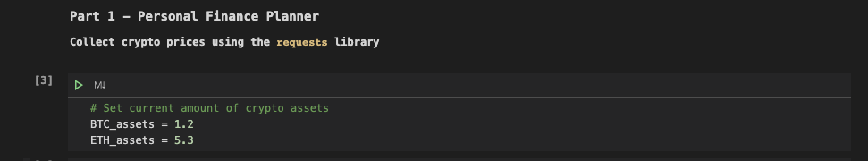
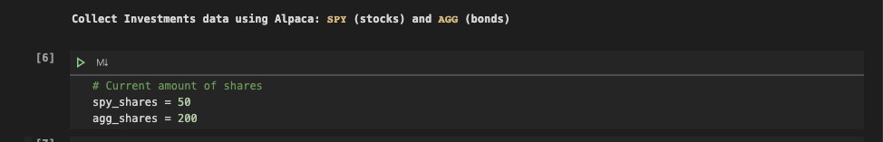
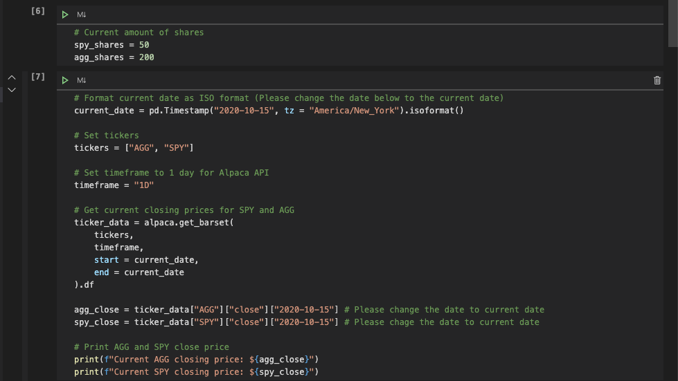
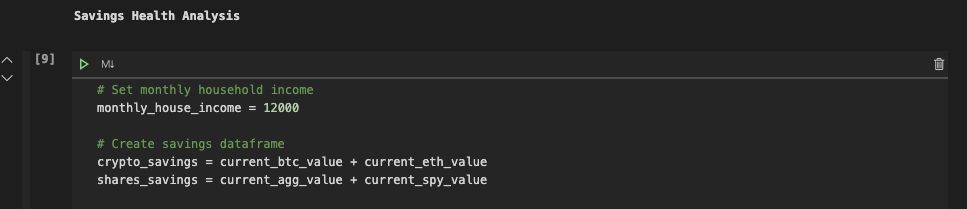
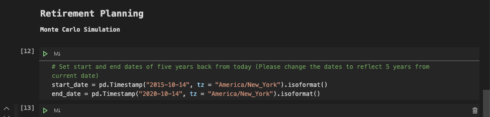
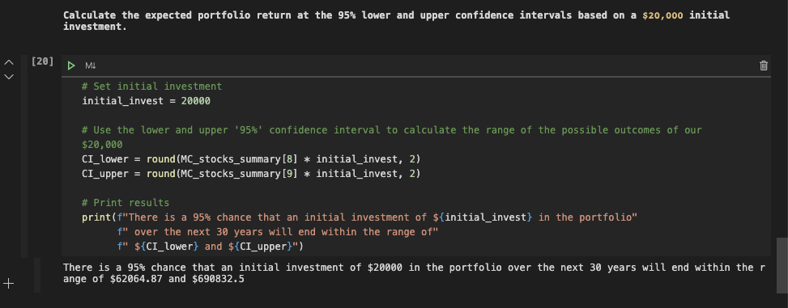
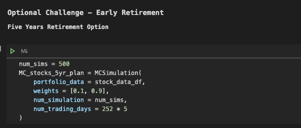
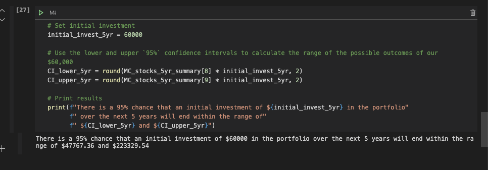

[^1]

# Financial Planning

Personal Financial Planner and Retirement Planning

---

## Overview

Personal Financial and Retirement Planner for clients of a Credit Union. It forecasts based on cryptocurrencies, stocks and bonds held by the clients.

Part 1 helps visualize the savings (cryptocurrencies and stocks)

Part 2 uses Monte Carlo simulations to project portfolio performance at 5, 10, and 30 years for early retirement and retirement planning.

---

## Installation

```python,
git clone https://github.com/ameghani10/Financial_Planning.git
```

Also need the following installed:

- Pandas
- Alpaca Trade API
- dotenv

And the following resource:

- MCForecast Tools (Included in the download)

---

## Running the Program

**Step 1**

- Input the current amount of BTC and ETH



- This will give the current value of cryptocurrency assets

**Step 2**

- Input amount of shares held for SPY and AGG



- Input todays date where indicated by comments in the code



- This will give the current value of shares held

**Step 3**

- Input the monthly household income



- This will generate a pie chart of savings


**Step 4**

- Input the start and end dates for the Monte Carlo Simulation as indicated by comment in the code



- This will return some graphs and a range of how much an initial investment of $20,000 will be worth in 30 years. The initial investment can be adjusted here!



**Step 5** **_Optional_**

- Here the initial investment and the weight of stocks and bonds in the portfolio to see their impact on future projections. Editable variables are:

    - Initial Investment
    - Weights
    - Number of Trading Days (252 * 'x' in years)





---

## Contributors

- Asif Meghani

Looking to contribute?
Contact me!

---

## Acknowledgements

MCForecastTools.py file has been provided by Rice University Trilogy Education Services

---

## Contact Me

linkedin - www.linkedin.com/in/asif-meghani-26a2a719

---

## License

MIT License

---

## Sources

1 Financial_Planning - https://lawrencefinancialplanning.com/blog/seven-ways-your-financial-advisor-should-be-helping-you-protect-your-estate-plan